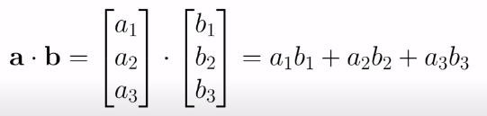

# Machine Learning Cheatsheet

1. Maths
   - Multivariable Calculus
   
   Most machine learning models are built with a dataset having several features or predictors. Hence familiarity with multivariable calculus is extremely important for building a machine learning model. Here are the topics you need to be familiar with:
    - Functions of several variables
   Derivatives and gradients
   Step function, Sigmoid function, Logit function, ReLU (Rectified Linear Unit) function
   Cost function
   Plotting of functions
   Minimum and Maximum values of a function
   - Linear Algebra
   Linear algebra is the most important math skill in machine learning. A dataset is represented as a matrix. Linear algebra is used in data preprocessing, data transformation, and model evaluation. Here are the topics you need to be familiar with:
   Vectors
   Matrices
   Transpose of a matrix
   The inverse of a matrix
   The determinant of a matrix
   Dot product
   Eigenvalues
   Eigenvectors
   (III) Optimization Methods
   Most machine learning algorithms perform predictive modeling by minimizing an objective function, thereby learning the weights that must be applied to the testing data in order to obtain the predicted labels. Here are the topics you need to be familiar with:
   Cost function/Objective function
   Likelihood function
   Error function
   Gradient Descent Algorithm and its variants (e.g., Stochastic Gradient Descent Algorithm)

2. Programming Basics
   Python and R are considered the top programming languages for data science. You may decide to focus on just one language. Python is widely adopted by industries and academic training programs. As a beginner, it is recommended that you focus on one language only.
   Here are some Python and R basics topics to master:
   Basic R syntax
   Foundational R programming concepts such as data types, vectors arithmetic, indexing, and data frames
   How to perform operations in R including sorting, data wrangling using dplyr, and data visualization with ggplot2
   R studio
   Object-oriented programming aspects of Python
   Jupyter notebooks
   Be able to work with Python libraries such as NumPy, pylab, seaborn, matplotlib, pandas, scikit-learn, TensorFlow, PyTorch
3. Data Basics
   Learn how to manipulate data in various formats, for example, CSV file, pdf file, text file, etc. Learn how to clean data, impute data, scale data, import and export data, and scrap data from the internet. Some packages of interest are pandas, NumPy, pdf tools, stringr, etc. Additionally, R and Python contain several inbuilt datasets that can be used for practice. Learn data transformation and dimensionality reduction techniques such as covariance matrix plot, principal component analysis (PCA), and linear discriminant analysis (LDA).
4. Probability and Statistics Basics
   Statistics and Probability is used for visualization of features, data preprocessing, feature transformation, data imputation, dimensionality reduction, feature engineering, model evaluation, etc. Here are the topics you need to be familiar with:
   Mean
   Median
   Mode
   Standard deviation/variance
   Correlation coefficient and the covariance matrix
   Probability distributions (Binomial, Poisson, Normal)
   p-value
   Baye’s Theorem (Precision, Recall, Positive Predictive Value, Negative Predictive Value, Confusion Matrix, ROC Curve)
   A/B Testing
   Monte Carlo Simulation
5. Data Visualization Basics
   Learn essential components of a good data visualization. A good data visualization is made up of several components that have to be pieced up together to produce an end product:
   a) Data Component: An important first step in deciding how to visualize data is to know what type of data it is, e.g., categorical data, discrete data, continuous data, time-series data, etc.
   b) Geometric Component: Here is where you decide what kind of visualization is suitable for your data, e.g., scatter plot, line graphs, bar plots, histograms, Q-Q plots, smooth densities, boxplots, pair plots, heatmaps, etc.
   c) Mapping Component: Here, you need to decide what variable to use as your x-variable and what to use as your y-variable. This is important, especially when your dataset is multi-dimensional with several features.
   d) Scale Component: Here, you decide what kind of scales to use, e.g., linear scale, log scale, etc.
   e) Labels Component: This includes things like axes labels, titles, legends, font size to use, etc.
   f) Ethical Component: Here, you want to make sure your visualization tells the true story. You need to be aware of your actions when cleaning, summarizing, manipulating, and producing a data visualization and ensure you aren’t using your visualization to mislead or manipulate your audience.
   Important data visualization tools include Python’s matplotlib and seaborn packages, and R’s ggplot2 package.
6. Linear Regression Basics
   Learn the fundamentals of simple and multiple linear regression analysis. Linear regression is used for supervised learning with continuous outcomes. Some tools for performing linear regression are given below:
   Python: NumPy, pylab, sci-kit-learn
   R: caret package
7. Machine Learning Basics
   a) Supervised Learning (Continuous Variable Prediction)
   Basic regression
   Multi regression analysis
   Regularized regression
   b) Supervised Learning (Discrete Variable Prediction)
   Logistic Regression Classifier
   Support Vector Machine (SVM) Classifier
   K-nearest neighbor (KNN) Classifier
   Decision Tree Classifier
   Random Forest Classifier
   Naive Bayes
   c) Unsupervised Learning
   Kmeans clustering algorithm
   Python tools for machine learning: Scikit-learn, Pytorch, TensorFlow.
8. Time Series Analysis Basics
   Use for a predictive model in cases where the outcome is time-dependent, e.g., predicting stock prices. There are 3 basic methods for analyzing time-series data:
   Exponential Smoothing
   ARIMA (Auto-Regressive Integrated Moving Average), which is a generalization of exponential smoothing
   GARCH (Generalized Auto Regressive Conditional Heteroskedasticity), which is an ARIMA-like model for analyzing variance.
   These 3 techniques can be implemented in Python and R.
9. Productivity Tools Basics
   Knowledge on how to use basic productivity tools such as R studio, Jupyter notebook, and GitHub, is essential. For Python, Anaconda Python is the best productivity tool to install. Advanced productivity tools such as AWS and Azure are also important tools to learn.
10. Data Science Project Planning Basics
    Learn basics on how to plan a project. Before building any machine learning model, it is important to sit down carefully and plan what you want your model to accomplish. Before delving into writing code, it is important that you understand the problem to be solved, the nature of the dataset, the type of model to build, how the model will be trained, tested, and evaluated. Project planning and project organization are essential for increasing productivity when working on a data science project. Some resources for project planning and organization are provided below.

## Linear Algebra

### Scalar

Just a number

### Vector

v = [a1,a2,a3]

operation over vectors:

- adition
- substraction
- multiplication
- division

### Vector + scalar


### Vector + vector (vector must have the same dimention)


### DOT product

The result is a scalar


### Basic neuron


### Matrix


### Transposition


### Multiply matrix with a scalar


### Matrix addition


### Matrix multiplication


# Numpy

The NumPy library is the core library for scientific computing in
Python. It provides a high-performance multidimensional array
object, and tools for working with these arrays. 

Use the following import convention:
```python
 import numpy as np
 ```
 ## 1D array
 ```python
 a = np.array([1,2,3])
 ```
 ## 2D array
  ```python
b = np.array([(1.5,2,3), (4,5,6)], dtype = float)
 ```
 ## 3D array
```python
 c = np.array([[(1.5,2,3), (4,5,6)], [(3,2,1), (4,5,6)]],
 dtype = float)
 ```
 ```python
 c.shape
(2, 2, 3)
 ```
 ## Initial Placeholders
 ```python
np.zeros((3,4)) ##Create an array of zeros

 np.ones((2,3,4),dtype=np.int16) ## Create an array of ones

 d = np.arange(10,25,5) ## Create an array of evenly spaced values (step value) 

np.linspace(0,2,9) ## Create an array of evenly 

e = np.full((2,2),7) ## Create a constant array  
```

